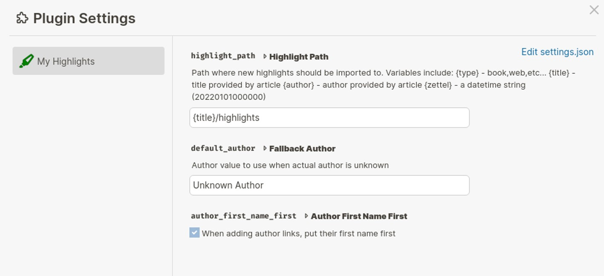
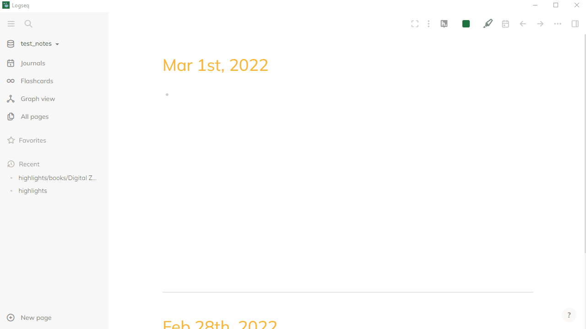

# My Highlights

[](https://github.com/theBenForce/logseq-plugin-my-highlights/releases)
[](https://github.com/theBenForce/logseq-plugin-my-highlights/actions/workflows/release.yml)


## Features

  - easliy import highlights and notes directly from your kindle
  - creates author links
  - highlights can be imported into your jounal or directly onto the book's page
  - Book page names can be customized

## Importing Highlights

To import highlights from your kindle's clipping file, click the highlighter icon in logseq.
A dialog will open, click the "Load Clippings File" button, this will open a file selection dialog.
Browse to your kindle and select the "My Clippings.txt" file.

After selecting the clippings file you will be presented with a list of books that you can
import highlights from. Select the checkbox next to each book that you would like to import and click
the "Import" button.

### Customizing Import Settings

If you open Settings -> Plugin Settings and select "My Highlights", you'll see a few options to
customize how "My Highlights" imports data.



#### Highlight Location

Your highlights can be imported into two different locations: journal pages or a page for the book. When importing into the journal, they will be placed on the date that the highlight was created, under a link to the book page.

#### Highlight Path

The setting that changes how your highlights are imported the most is the "Highlight Path" setting. This
changes the title of the page where your imports will be stored. You can set this to anything that you
want, but each book will need a unique title.

When editing the highlight path you can use the following variables:

| Variable | Description |
| --- | --- |
| {title} | Title of the book that's being imported |
| {author} | Name of the first author listed on the book |
| {type} | Type of highlights being imoprted, right now this will only be 'Book' |
| {zettel} | A date time string to guarantee uniqueness. Only us this if you don't want to import more highlights later |

#### Fallback Author

If for some reason the clippings file doesn't have an author listed, this value will be used instead.

#### Author First Name First

By default, author names are listed as "Last, First". Check this box if you would rather have authors listed as "First Last".

### Adding More Details (beta)

> This feature is in beta testing and may not work yet

If you would like to add the book's cover image, ASIN, and a link to the kindle web reader to the
book page during import click the "Next" button instead of "Import". This will take you to a second
page.

On the second page, select a book from the list on the left and you will see search results from
Amazon on the right. Select the search result that matches the selected book. If you don't see the
book that you want in the initial search results, change the query and click "Search" to see different
results.

After you've selected the details once, you shouldn't need to select them again on future imports.



## Hiding Highlight ID Properties

To hide the highlight IDs, open settings and click "Edit config.edn". Towards
the bottom you'll see a comment about hiding specific properties, modify that
section to look like this:

```
 ;; hide specific properties for blocks
 ;; E.g. #{:created-at :updated-at}
 :block-hidden-properties #{:highlight-id}
```

## Manual Installation

You can manually install this plugin by downloading the [latest release](https://github.com/theBenForce/logseq-plugin-my-highlights/releases). Download the `logseq-plugin-my-highlights-*.zip` file and unzip its contents to `USER_DIR/.logseq/plugins/logseq-plugin-my-highlights`. Now just reload logseq and you should see the "My Highlights" icon in your toolbar.

## References
  1. https://github.com/believer/kindle-highlights/tree/main/packages/parser
  2. https://reactjsexample.com/logseq-plugin-boilerplate-w-react-vite/
  3. https://github.com/hadynz/obsidian-kindle-plugin
  4. https://www.npmjs.com/package/@hadynz/kindle-clippings

## Support

If you find this plugin useful, please consider [buying me a coffee](https://www.buymeacoffee.com/theBenForce/e/80852).
